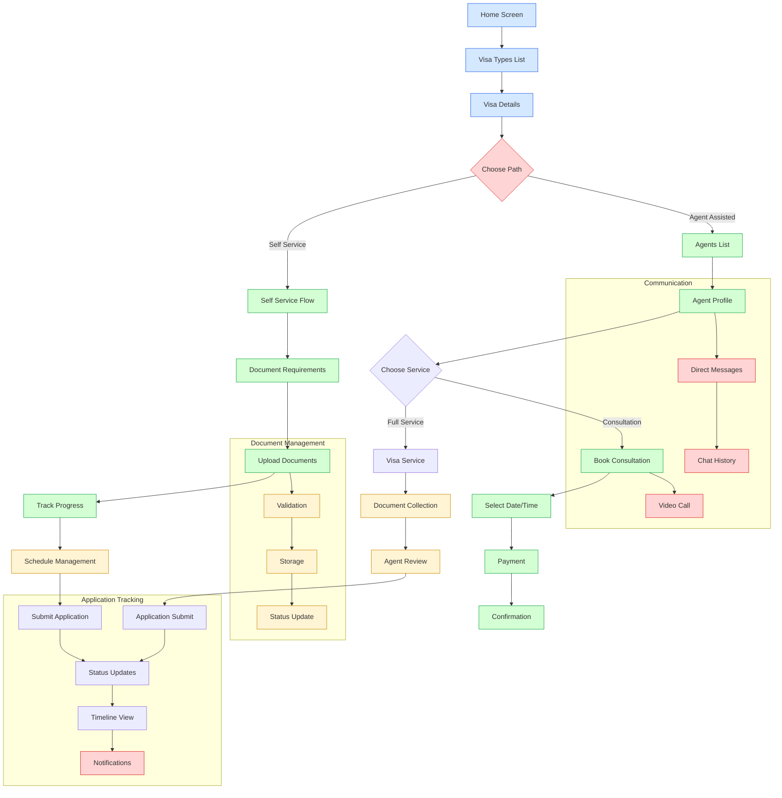
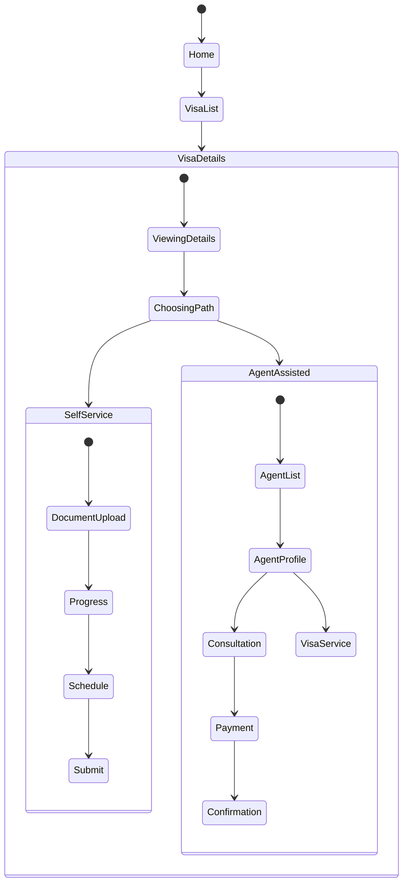

# Japa - Visa Application Assistant

## Project Overview
Japa is a mobile application designed to simplify the visa application process by providing guided assistance for both self-service applications and agent-assisted applications. The app helps users manage document requirements, schedule consultations, and track application progress.

## Core Features

### 1. Visa Application Flows
- **Self-Service Path**
  - ✅ Document requirement checklist
  - ✅ Document upload functionality
  - ✅ Progress tracking
  - 🚧 Schedule management
  - 🚧 Timeline view
  - ⏳ Document validation

- **Agent-Assisted Path**
  - ✅ Agent listing and profiles
  - ✅ Consultation booking
  - ✅ Agent ratings and reviews
  - 🚧 Direct messaging
  - ⏳ Video consultation integration

### 2. Navigation Structure
```typescript
/(tabs)
├── index.tsx // Home screen
├── apply/
│ ├── index.tsx // Visa types listing
│ ├── visa-details/[id] // Visa type details
│ ├── agents/ // Agent listing
│ │ ├── [id] // Agent profile
│ │ ├── book-consultation
│ │ └── visa-service/[type]
│ └── self-service/[id] // Self-service application
```

## Data Models

### Visa Types
```typescript
interface VisaType {
  id: string;
  name: string;
  description: string;
  country: string;
  requirements: Requirement[];
  agents: string[];
  processingTime: string;
  price: number;
}
```

### Applications
```typescript
interface VisaApplication {
  id: string;
  visaTypeId: string;
  userId: string;
  mode: "self" | "agent";
  status: "pending" | "in_progress" | "completed" | "rejected";
  progress: number;
  schedule: Schedule[];
  documents: Document[];
}
```

## Current Status

### Completed
1. Basic navigation structure
2. Visa type listing with country flags
3. Agent profiles and listing
4. Document upload functionality
5. Progress tracking for self-service applications
6. Consultation booking flow

### In Progress
1. Document validation and verification
2. Schedule management for requirements
3. Timeline view for application progress
4. Agent messaging system

### Planned Features
1. Video consultation integration
2. Document OCR verification
3. Payment integration
4. Push notifications
5. Application status updates
6. Multi-language support

## Design Guidelines
- Use consistent spacing (px-4 py-4 for sections)
- Maintain consistent card styling (rounded-xl with border-gray-200)
- Use blue-600 (#2563eb) as primary color
- Consistent typography scale
- Proper error handling and loading states

## Technical Stack
- React Native with Expo
- TypeScript for type safety
- TailwindCSS for styling
- Expo Router for navigation
- Lucide icons
- React Native Safe Area Context

## Known Issues
1. Layout spacing in apply route needs adjustment
2. Document picker needs proper error handling
3. Navigation type definitions need updating
4. Loading states needed for async operations

## Next Steps
1. Implement document validation
2. Add schedule management
3. Create timeline view
4. Set up agent messaging
5. Add loading states
6. Implement search and filtering

## Testing Requirements
- Document upload size limits
- Supported file types
- Navigation flow testing
- Form validation
- Error handling
- Loading states
- Offline support

## Security Considerations
- Secure document storage
- User authentication
- Data encryption
- Session management
- Permission handling

This context will be continuously updated as the project evolves.

## Application Flow
### Japa - Visa Application Assistant



## Screen States

