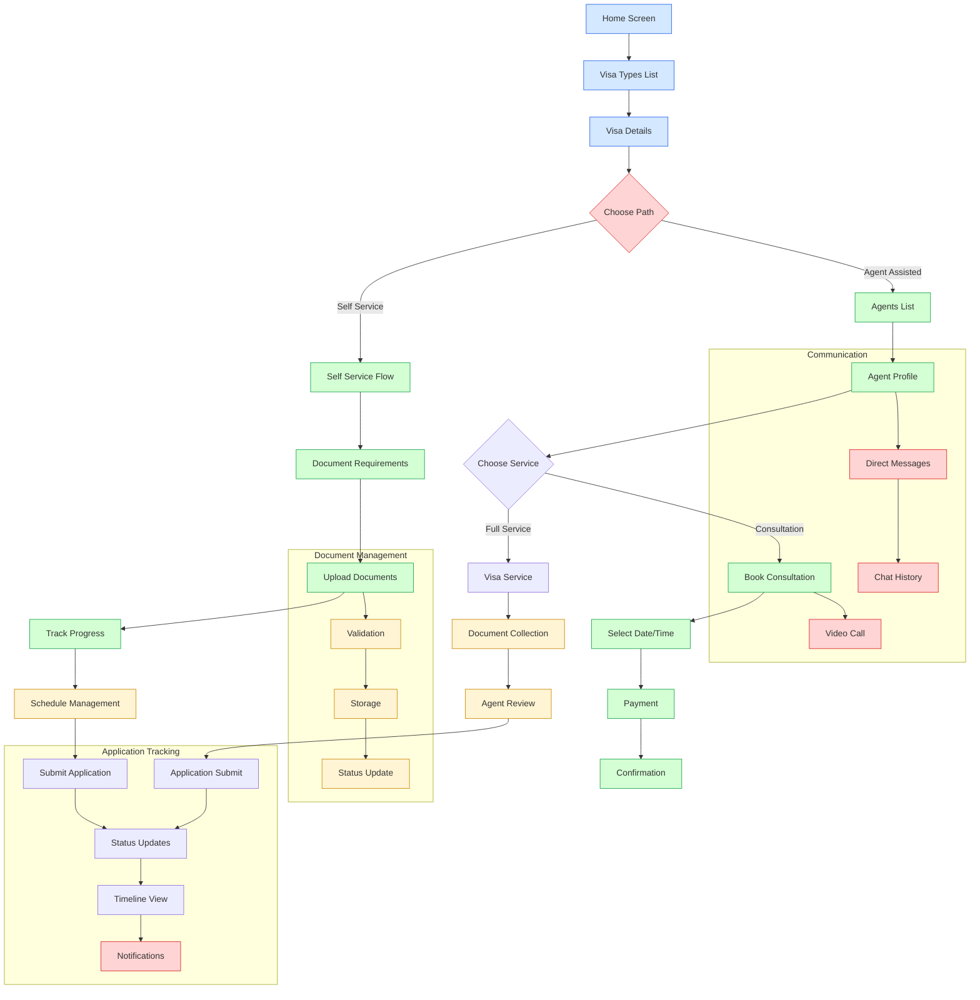
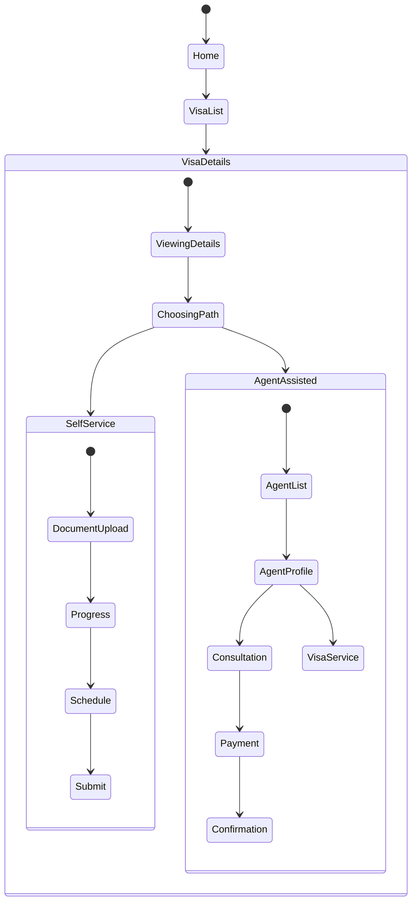

# Seli — Visa Application Assistant

> The app is branded **Seli**; the repo/dir names and legacy infra ids stay `japa`.

## Project Overview

Seli is a mobile application designed to simplify the
visa application process by providing guided assistance
for both self-service applications and agent-assisted
applications. The app helps users manage document requirements,
schedule consultations, and track application progress.

## Getting Started

### Prerequisites

- Node.js 18+
- npm or yarn
- Expo CLI (`npm install -g expo-cli`)
- iOS Simulator (macOS) or Android Emulator
- A **development build** for on-device/simulator testing — **Expo Go will not
  work**, because the app uses `@react-native-firebase/*` (native modules). Build a
  dev client with EAS (`npm run build:dev`) or run a local prebuild (`npm run ios` /
  `npm run android`).

### Installation

```bash
# Clone the repository
git clone <repository-url>
cd japa-mobile

# Install dependencies
npm install
```

### Running the App

```bash
# Start the development server
npm start

# Run on iOS Simulator
npm run start:ios
# or
npx expo start --ios

# Run on Android Emulator
npm run start:android
# or
npx expo start --android

# Run directly on native device (requires prebuild)
npm run ios
npm run android
```

## Environment Configuration

The app targets a different Firebase project + backend per environment, selected by
the **`APP_ENV`** variable. There are no manual config-file swaps.

| `APP_ENV`     | Firebase project  | Backend API                                          |
| ------------- | ----------------- | ---------------------------------------------------- |
| `development` | `durin-seli-dev`  | `https://us-central1-durin-seli-dev.cloudfunctions.net/api` |
| `staging`     | `durin-seli-dev`  | (same as development)                                |
| `production`  | `japa-platform`   | `https://us-central1-japa-platform.cloudfunctions.net/api`  |

`APP_ENV` is set automatically by each EAS build profile (`eas.json`:
development / preview→staging / production). For local runs it **defaults to
`development`**, so a bare `npm start` talks to the deployed **durin-seli-dev** backend.

### How it fits together

- **`app.config.ts`** — reads `APP_ENV`, picks the native Firebase config file, and
  bakes `apiUrl` / `firebaseProjectId` / `appEnv` / `useEmulator` into `expo.extra`.
- **`src/config/env.ts`** — the single runtime source for `API_URL`,
  `FIREBASE_PROJECT_ID`, `USE_EMULATOR`, etc. (reads `expo.extra`). `api.service.ts`
  and `auth.service.ts` consume it — nothing at runtime reads `process.env` directly.
- **`firebase/dev/`** and **`firebase/prod/`** — the per-project
  `google-services.json` / `GoogleService-Info.plist`. Expo prebuild copies the
  selected one into the native project at build time.

> **Auth must match the backend.** Mobile Firebase Auth mints ID tokens for the
> configured project; the backend it calls verifies them against the same project.
> That's why the API URL and the Firebase config are always chosen together — a
> mismatch 401s every authenticated request.

> **A config change requires a fresh build.** The native Firebase config is baked in
> at build time, so switching environments (or a first-time setup) needs a new dev
> build — an already-installed client keeps its old project until rebuilt.

### Local emulator suite (optional)

To develop against a local `firebase emulators:start` instead of the deployed
backend, opt in explicitly (it is **off by default**):

```bash
EXPO_PUBLIC_USE_EMULATOR=true npm start
```

This routes both the API and Firebase Auth at the local emulators for the current
`APP_ENV`'s project id. (Android emulators reach the host via `10.0.2.2`, handled
automatically.)

### Build Commands

```bash
# Development builds
npm run build:dev           # Both platforms
npm run build:dev:ios       # iOS only
npm run build:dev:android   # Android only

# Preview builds (staging)
npm run build:preview
npm run build:preview:ios
npm run build:preview:android

# Production builds
npm run build:prod
npm run build:prod:ios
npm run build:prod:android

# Submit to app stores
npm run submit:prod
npm run submit:prod:ios
npm run submit:prod:android
```

### Other Commands

```bash
npm run lint          # Run ESLint with auto-fix
npm run test          # Run Jest tests
npm run prebuild      # Clean prebuild for native code
npm run clean         # Remove all build artifacts and node_modules
```

## Core Features

### 1. Visa Application Flows

- **Self-Service Path**
  - ✅ Document requirement checklist
  - ✅ Document upload functionality
  - ✅ Progress tracking
  - 🚧 Schedule management
  - 🚧 Timeline view
  - ⏳ Document validation

- **Agent-Assisted Path**
  - ✅ Agent listing and profiles
  - ✅ Consultation booking
  - ✅ Agent ratings and reviews
  - 🚧 Direct messaging
  - ⏳ Video consultation integration

### 2. Account & Notifications

- **Account security (self-service):** verify email, change password, change email
  (verification-gated), and delete account — reached from **Settings**. Each
  triggers a branded transactional email from the backend (Resend). See
  `src/app/{verify-email,change-password,change-email,delete-account}.tsx`.
- **Notification preferences:** per-user email / push channel toggles in Settings,
  persisted via `PATCH /users/me/notification-preferences`. Security-critical emails
  (e.g. "password changed") ignore the opt-out.
- **Push notifications:** FCM via `src/services/push-notification.service.ts` —
  registered after login, cleaned up on logout.

> Emails are **never sent from the client** — the app calls backend endpoints that
> send them. No email-provider keys live in the app.

### 3. Navigation Structure

The coral/cream **Explorer** experience is now the whole app (it replaced the older
blue `(tabs)/apply` shell). Its screens live directly under `src/app/`, with a
5-tab shell and pushed detail/flow screens:

```text
src/app/
├── index.tsx                 // entry redirect (auth-gated)
├── (auth)/                   // welcome, login, register, forgot-password, otp
├── (onboard)/                // passport, country, personal-info, complete
├── (tabs)/                   // home · explore · agents · tracker · profile
├── destination/[id]          // country / destination detail
├── visa/[id]                 // visa breakdown
├── agent/[id], agency/[id]   // agent + agency profiles
├── book/[agentId], pay, confirmation   // consultation booking flow
├── eligibility/, messages/, consultations, documents, payments, notifications
├── settings.tsx              // → verify-email · change-password · change-email · delete-account
└── verify-identity.tsx       // client KYC (NIN/BVN)
```

## Data Models

### Visa Types

```typescript
interface VisaType {
  id: string;
  name: string;
  description: string;
  country: string;
  requirements: Requirement[];
  agents: string[];
  processingTime: string;
  price: number;
}
```

### Applications

```typescript
interface VisaApplication {
  id: string;
  visaTypeId: string;
  userId: string;
  mode: "self" | "agent";
  status: "pending" | "in_progress" | "completed" | "rejected";
  progress: number;
  schedule: Schedule[];
  documents: Document[];
}
```

## Current Status

### Completed

1. Basic navigation structure
2. Visa type listing with country flags
3. Agent profiles and listing
4. Document upload functionality
5. Progress tracking for self-service applications
6. Consultation booking flow

### In Progress

1. Document validation and verification
2. Schedule management for requirements
3. Timeline view for application progress
4. Agent messaging system

### Planned Features

1. Video consultation integration
2. Document OCR verification
3. Multi-language support

## Design Guidelines

The app uses the **Explorer** design language — a warm coral + cream palette with a
Space Grotesk display face. Tokens live in `src/components/explorer/theme.ts` (`EX`).

- Primary/accent: coral `#F4516C`; background: cream `#FFFBF5`; ink `#171326`
- Reuse `EX` tokens (colors, spacing, shadows) rather than hardcoding values
- Consistent card styling (rounded, hairline `EX.color.line*` borders, soft shadow)
- Proper error handling and loading states

## Technical Stack

- React Native 0.79 + Expo 53
- TypeScript for type safety
- NativeWind (TailwindCSS) + the Explorer `EX` design tokens for styling
- Expo Router for navigation
- Zustand (client state) + React Query (server state)
- Firebase via `@react-native-firebase/*` (Auth, Crashlytics, Analytics, Messaging)
- Lucide icons · React Native Safe Area Context

## Known Issues

1. Layout spacing in apply route needs adjustment
2. Document picker needs proper error handling
3. Navigation type definitions need updating
4. Loading states needed for async operations

## Next Steps

1. Implement document validation
2. Add schedule management
3. Create timeline view
4. Set up agent messaging
5. Add loading states
6. Implement search and filtering

## Testing Requirements

- Document upload size limits
- Supported file types
- Navigation flow testing
- Form validation
- Error handling
- Loading states
- Offline support

## Security Considerations

- Secure document storage
- User authentication
- Data encryption
- Session management
- Permission handling

This context will be continuously updated as the project evolves.

## Application Flow



## Screen States



## Authorization & Entitlements

Subscription-gated features via the shared **`@durin-tech/authz`** package:

- `useAuthorization()` / `useFeature()` fetch `GET /users/me/authorization` (React Query) and rebuild the
  CASL ability for UI gating — the backend remains authoritative.
- `<FeatureGate feature="…">` shows a `Paywall` when a feature is locked. Subscriptions are bought on the
  **web portal** (app-to-web purchase) to avoid App Store / Play IAP — the app just reads the resulting
  entitlement. Gating is safe-rollout (nothing paywalls until the user has entitlements).

`@durin-tech/authz` is a **private** GitHub Packages package: local installs use
`NODE_AUTH_TOKEN="$(gh auth token)" npm install`; EAS builds need a `NODE_AUTH_TOKEN` secret. See
[`todo.md`](./todo.md).
